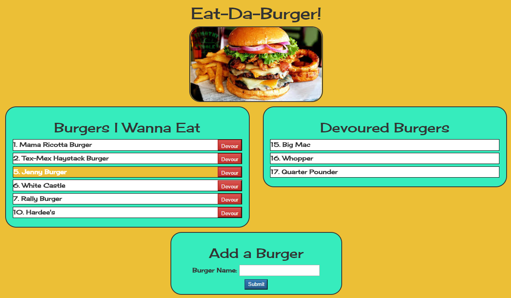

# Eat-Da-Sequalized-Burger

This project was homework for the UNCC Coding Boot Camp. The goal was to revise the previous Eat-Da-Burger assignment by using Sequelize as the ORM. 

## Getting Started

Clone or download this repo to your local system. 

### Prerequisites

Both of these will need to be installed and running:

* Node.js
* MySQL 

### Installing

To load all required NPM packages, navigate to the new folder in your terminal window and run  

```
npm install
```

You will need to create a MySQL database called 'burgers_db'. Within the the db folder, you will find 'schema.sql' to create the database & table. If you wish, 'seeds.sql' contains a few sample records to get you started.

To start Express web server, in your terminal window run  

```
node server
```
## Running the tests

To use the app, open your browser and navigate to 

```
http://localhost:3000/index
```

You should see something like this:



Have fun!

## Built With

* [Node.js](https://nodejs.org/en/)
* [MySQL](https://www.mysql.com/pache.org/)
* [Handlebars](http://handlebarsjs.com/)
* [Express](https://expressjs.com/)
* [Sequelize](http://docs.sequelizejs.com/)

## Authors

* **Dan Phillips** - [dlphillips](https://github.com/dlphillips/)

## Acknowledgments

* [@darinboesch](https://github.com/darinboesch) & the TA's Chris Carter & Dave Jan

